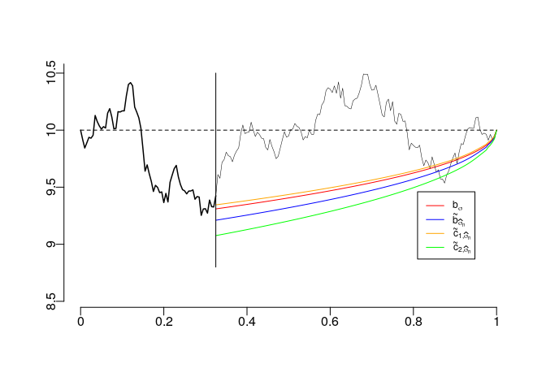

Description
===========

Software companion for the paper "Optimaly excercising American options under the stock pinning effect". It implements the proposed methods and allows to reproduced the simulation study carried out therein.

Usage example
=============

Despite the scripts are fairly commented and we provide test examples for each one of the functions, we display here an example that might be useful as it illustrates how to use most of the functions in a single shoot.

``` r
source("0-simulations.R")
source("1-boundary_computation_BB-AmPut_discount.R")
source("2-inference_BB.R")

set.seed(49)

# Initial settings
T <- 1        # expiration date
sigma <- 1    # volatility
N <- 2e2      # number of points (N + 1) used to discretize the interval [0, T]
S <- 10       # Strike price
t <- seq(0, T, by = 1/N)  # equally-spaced partition of the interval [0, T]
alpha = 0.05  # confidence level
samp <- rBB(n = 1, N = N, a = S, b = S, sigma = 1)
```

    ## Loading required package: mvtnorm

``` r
N1 <- floor(N / 3) # Cut point

# Sigma estiamtion via MLE
Sigma <- SigMl(samp = samp, T = T, N1 = N1)

# True boundary
boundary.true <- S - 0.8399 * sigma * sqrt(T - t)

# Logaritmically-spaced partition
tlog <- log(seq(exp(0), exp(1), l = N + 1)) 

# Boundary computation and confidence curves
boundary <- b_BB_AmPut(S = S, sigma = drop(Sigma), t = tlog, r = 0)
boundary <- b_BB_AmPut_Conf(bnd = boundary, S = S, r = 0, sigma = drop(Sigma), 
                            t = tlog, nsamp = N1, alpha = alpha, eps = 0.001)

# Spline interpolation
boundary$bBB <- splinefun(tlog, boundary$bBB)(t)
boundary$bBB.low <- splinefun(tlog, boundary$bBB.low)(t)
boundary$bBB.up <- splinefun(tlog, boundary$bBB.up)(t)

# Plot zone
plot(t, samp, type = "n", xlab = "", ylab = "", ylim = c(8.5, 10.5), 
     xlim = c(0, 1), bty = "n", yaxt = "n", xaxt = "n")
lines(t[1:N1], samp[1:N1], lty = 1, lwd = 1.5)
lines(t[N1:(N + 1)], boundary.true[N1:(N + 1)], lty = 1, lwd = 1, col = "red")
lines(t[N1:(N + 1)], samp[N1:(N + 1)], lty = 1, lwd = 0.5)
lines(t[N1:(N + 1)], boundary$bBB[N1:(N + 1)], lty = 1, lwd = 1, col = "blue")
lines(t[N1:(N + 1)], boundary$bBB.up[N1:(N + 1)], lty = 1, lwd = 1, col = "orange")
lines(t[N1:(N + 1)], boundary$bBB.low[N1:(N + 1)], lty = 1, lwd = 1, col = "green")
lines(c(t[N1], t[N1]), c(8.8, 10.5), lty = 1)
lines(c(0, 1), c(S, S), lty = 2)
axis(1, at = c(0, 0.2, 0.4, 0.6, 0.8, 1), 
     labels = c("0", "0.2", "0.4", "0.6", "0.8", "1"), padj = -1,  line = -0.2)
axis(2, at = c(8.5, 9, 9.5, 10, 10.5, 11), 
     labels = c("8.5", "9", "9.5", "10", "10.5", "11"), padj = 1)
legend(x = 0.81, y = 9.46, legend = c(TeX("$b_{\\sigma}$"), 
                                 TeX("$\\tilde{b}_{\\widehat{\\sigma}_{n}}$"), 
                                 TeX("$\\tilde{c}_{1,\\widehat{\\sigma}_{n}}$"), 
                                 TeX("$\\tilde{c}_{2,\\widehat{\\sigma}_{n}}$")), 
       lty = c(1, 1, 1, 1), lwd = c(1, 1 , 1, 1), 
       col = c("red", "blue", "orange", "green"), cex = 0.75)
```


